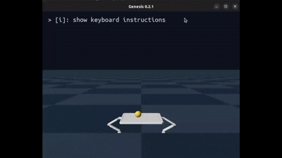
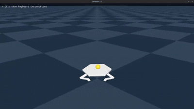

# RL Controller for Autonomous Juggling Platform

## Getting Started

### Prerequisites
#### Install NVIDIA drivers
> [!NOTE]  
> In Ubuntu, get to additional drivers. Verify by running: `nvidia-smi`

#### Install Docker
> [!NOTE]  
> Follow these [Docker Installation Steps](https://docs.docker.com/engine/install/ubuntu/)

> [!IMPORTANT]  
> Make sure it can run without sudo by following [these steps](https://docs.docker.com/engine/install/linux-postinstall/).

#### Install NVIDIA Container Toolkit
> [!NOTE]  
> Follow these [NVIDIA Container Toolkit Installation Steps](https://docs.nvidia.com/datacenter/cloud-native/container-toolkit/latest/install-guide.html#docker)

> [!IMPORTANT]  
> Make sure to configure the container runtime by using the `nvidia-ctk` command and restart the Docker daemon.

### Clone Repository
Clone this repository using:
```
cd ~/
git clone https://github.com/martinsoteIo/rl_bouncer.git
```

### Build the Docker Image and Run the Container
> [!IMPORTANT]  
> Depending on your CUDA version (verify through `nvidia-smi`) you may need to modify the `CUDA_MAJOR` and `CUDA_MINOR` variables in the `docker-compose.yaml` file to the corresponding values.

Building the Docker Image and running the container from the Dockerfile using Docker Compose is really simple, you just need to run:
```
cd ~/rl_bouncer/
docker compose build rl_bouncer
docker compose up -d
docker exec -it rl_bouncer-rl_bouncer-1 bash
pip install -e ./src/rl_policies
```

Once the container is running you can attach any terminal to the container by running:
```
docker exec -it rl_bouncer-rl_bouncer-1 bash
```

## System Demonstration

The project follows an incremental development strategy, beginning with a restricted 2D model to validate the baseline algorithms before transitioning to a full 3D spatial parallel manipulator.

| **2D Planar Balancing (XZ Plane)** | **3D Spatial Balancing (XYZ Space)** |
| :---: | :---: |
|  |  |
| **2 Motors** restricting movement to the XZ plane. | **3 Motors (3-RRS)** allowing full spatial control. |

## Interactive Visualization & Teleop

You can manually test the stability and response of both the Reinforcement Learning policies and the classical PD baselines using the following commands inside the Docker container. 

*Use your **keyboard arrows** to move the target during teleoperation.*

### 2D Planar Platform
**Classical Control (PD Baseline)**
```bash
juggling_2d_eval_teleop_pd
```

**Reinforcement Learning (RL)**
```bash
juggling_2d_eval_teleop
```

### 3D Spatial Platform (3-RRS Mechanism)
**Classical Control (PD Baseline)**
```bash
juggling_3d_eval_teleop_pd
```

### 3D Planar Platform
**Reinforcement Learning (RL)**
```bash
juggling_3d_eval_teleop
```


